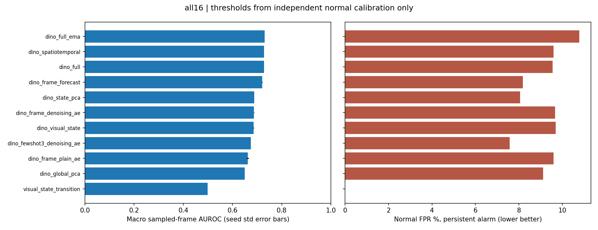
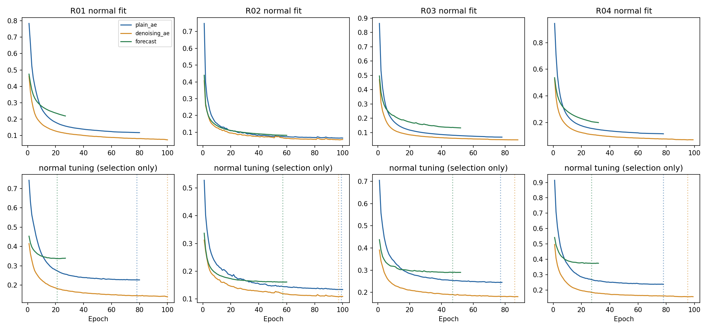
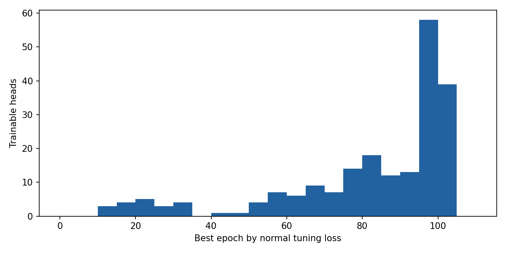
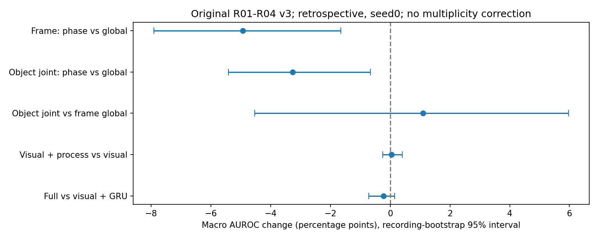

# IPAD Normal-only Industrial Video Anomaly Detection

**정상 공정 영상만으로 정상의 기준을 배우고, 새 영상에서 외형·움직임·순서가 달라진 구간을 찾는 학부 연구 프로젝트.**

2026-10-04~05 로컬 GPU에서 수행한 초기 비교, 멘토 제안 전체 파이프라인, 16개 장면 고도화, 객체/단계/공정 규칙 검증을 기록한다. 좋은 결과뿐 아니라 불필요했던 모듈, 오검출, 교정 실패와 재현 제한도 보존한다.

> **현재 상태:** 연구용 구현·정상-only 학습·구성별 평가·저장 모델 추론 검증을 완료했다. 산업 현장 검증이나 모든 공정에 적용되는 상용 모델을 완성한 것은 아니다. AUROC는 분류 정확도가 아니며 복잡한 Full pipeline이 가장 좋았다고 주장하지 않는다.

> **공개 전환:** 사용자가 비공개에서 공개로 전환한 저장소다. 이번 업데이트에는 코드·설명·수치 결과·데이터 이미지가 없는 성능 그래프만 새로 포함한다. 이전 커밋/기존 Release의 시연 이미지·영상·모델 파일은 보존되어 있다. 이를 데이터/가중치 재배포 허가의 증거로 해석하면 안 된다. [공개 범위](docs/REPRODUCIBILITY.md)를 확인한다.

## 1. 결과부터 보기

핵심 결론은 다음과 같다.

- 단순 DINO 정상 공간보다 AE/GRU를 결합한 화면 경로가 16개 장면 평균 순위 성능을 개선했다.
- 객체 경로는 실제 촬영4장면에서 비교했지만 배경 물체 오검출 때문에 오경보가 크다.
- 기존 phase-conditioned subspace/process는 넣었다는 사실만으로 기여가 입증되지 않았다. 동일조건 제거 비교에서는 phase 조건이 불리했다.
- crop-only 후속 실험은 오경보를 줄였지만 미탐·성능 저하가 따른다. 독립 검증된 최종 해결책이 아니다.
- 객체/단계 지각이 틀리면 올바른 규칙 코드도 공정 이상을 판단하지 못한다. 원본 프레임 재추론 감사에서 이 문제를 확인했다.

### 완료한 실험의 규모

| 실험 | 완료 범위 | 숫자의 의미 |
|---|---|---|
| 초기 표현/방법 비교 | R01~R04,44개 평균,원CSV248행/집계support176행 | epoch0 반복 저장 제외,44개 새 알고리즘 아님 |
| 초기 few-shot PCA | 40개 장면별 실행 | 3/5/10 fit 녹화 × 3선택 + 전체 fit, 각4장면 |
| 기존 Full pipeline v3 | R4, 18가지 점수 구성, 72개 결과 | phase MLP10ep, AE/객체 GRU5·10ep |
| 16장면 고도화 | R4 + 합성 S12, seed0/1/2 | 48장면×seed 설정, 208학습 헤드, 580평가 행 |
| 추가 crop-only 탐색 | R4 × 3seed | 추가24학습 헤드, 48평가 행 |
| 고도화 총계 | 주 실험 + 추가 탐색 | **232학습 헤드, 628장면×seed×방법 평가 행** |
| 객체/phase 감사 | 정상48표본 프레임 | AI 시각 참고 검토, 사람 정답 아님 |
| 규칙 계약 검사 | 99개 oracle 사례 | phase 기호를 직접 넣은 기능 검사 |
| 원본 영상 스트레스 | 16입력, 1,880관측 | 정상/역순/80·140반복을 detector부터 재실행 |

232는 **고도화에서 학습한 작은 head 수**다. GPT/DINO/CLIP을232번 처음부터 학습했다는 뜻도, 초기 파일럿을 합산한 전 프로젝트 총 학습 수라는 뜻도 아니다. 628은 평가 표의 행 수이며628개 새 구조가 아니다.

### 같은 고도화 분할 안에서의 핵심 결과

FPR/recall은 **지속 경고 기준**이다. 이전 v3의 프레임 FPR와 섞어 직접 비교하지 않는다. 수치는 장면별 동등 가중 평균 후 seed 평균이다.

| 범위 | 방법 | AUROC | AP | 경고 FPR ↓ | 경고 recall ↑ |
|---|---|---:|---:|---:|---:|
| all16 화면 | DINO global PCA | 64.91% | 39.64% | 9.11% | 15.86% |
| all16 화면 | DINO denoising AE | 68.75% | 42.53% | 9.66% | 18.12% |
| all16 화면 | DAE + GRU + 상태 + EMA | **73.09%** | 44.95% | 10.78% | 22.84% |
| 실제 촬영R4 | 위 화면 복합형 | **78.24%** | 70.14% | 21.59% | 45.97% |
| 실제 촬영R4 | 객체 ROI DAE + 화면 DAE + 객체 GRU + EMA | **78.39%** | 67.59% | 22.80% | 39.69% |
| R4, 사후 탐색 | crop-only DAE | 74.34% | 66.57% | **3.43%** | 24.74% |
| R4, 사후 탐색 | crop-only DAE + GRU + EMA | 75.80% | 67.95% | 8.57% | 33.91% |

78.39%와78.24%의 작은 차이로 객체 경로가 전반적으로 우수하다고 단정할 수 없다. 화면 모델의 AP·recall이 더 높고 객체 경로는 느리다. 낮은 FPR만 보면 crop-only가 매력적이지만 미탐도 함께 봐야 한다.



### 읽는 순서

| 문서 | 내용 |
|---|---|
| [실험 연대기](docs/EXPERIMENT_LOG.md) | 초기 → v3 → 고도화 → crop → 감사, 변경 이유와 완료/미완료 |
| [1~13단계 가이드](docs/PIPELINE_GUIDE.md) | 각 단계의 목적·입출력·코드·실제 수행·제안과 차이 |
| [기존18개 방법](docs/METHODS.md) | v3 점수 구성. 고도화18개 union과 다른 표 |
| [고도화 방법·설정](docs/ADVANCED_EXPERIMENTS.md) | 208+24헤드 구성, 정상학습/ROI/상태/결합식 |
| [전체 수치 표](docs/RESULT_TABLES.md) | 초기44평균, 고도화 그룹 평균,16장면 실제 분할 |
| [객체/phase/규칙 감사](docs/PIPELINE_AUDIT.md) | 실패,99계약,16raw stress,팀원 비교 |
| [평가 지표 사전](docs/METRICS.md) | AUROC/AP,frame/alarm,event/video,bootstrap와 단위 |
| [재현·공개 범위](docs/REPRODUCIBILITY.md) | 설치,학습 명령,필수 별도 자료,제외한 파일 |
| [출처·revision](docs/SOURCES.md) | 데이터/논문/모듈/팀 참고 코드 attribution |

실행 당시 보고서: [초기 비교](output/meeting_20261004/회의용_비교결과.md), [기존v3](output/full_pipeline_20261004/완성결과_읽어주세요.md), [16장면 고도화](output/advanced_20261005/결과보고서.md), [최근 감사](output/pipeline_audit_20261005/검증결과_팀원설명.md). 날짜가 다른 보고서는 해당 실행의 스냅샷이며 현재 전체 범위는 이 README를 기준으로 본다.

## 2. 프로젝트가 풀려는 문제

일반적인 정상/불량 분류는 불량 예시도 학습에 필요하다. 이번 프로젝트는 **정상 영상만으로 학습**한다. 정상 특징·재구성·예측의 기준을 만들고, 새 영상이 기준과 얼마나 다른지 연속 점수로 출력한다.

IPAD ZIP에는 연속 JPG가 있어 동영상 순서를 보존해 읽는다. MP4도 입력할 수 있다. 프레임을 image tensor로 바꾼다고 시간 정보를 버리는 것은 아니다. PCA/AE는 현재 특징을 보고 GRU와 상태 전이는 과거 관측을 사용한다.

출력은 표본 프레임 이상 점수, 정상 calibration으로 정한 threshold 경고, 가능한 객체 후보 bbox/patch residual이다. 불량을 수리하거나 영상을 고화질로 복원하는 모델이 아니다. AE의 **재구성은 정상 feature를 복원하는 학습 목표**다.

공정마다 정상이 달라 현재는 장면별 정상 기준/헤드를 따로 맞춘다. 공통 코드를 다른 공정에 다시 쓰는 것과 하나의 가중치가 모든 신규 공장에 즉시 적용되는 것은 다르다.

## 3. 데이터와 정상-only 분할

[IPAD](https://ljf1113.github.io/IPAD_VAD/) R01~R04와 S01~S12를 사용했다. R은 실제 촬영, S는 합성 장면이며 R03에는 장난감 지게차 실험이 포함된다. **16개의 실제 보잉 공장을 검증한 결과가 아니다.**

### 초기/v3

정상 녹화 seed0, 약80% train / 20% normal validation. 테스트에는 정상/이상이 있다. 이웃 프레임을 무작위로 train/validation에 섞지 않았다. 기본 stride4다.

| 장면 | 정상 train 관측 | 정상 validation 관측 | test 관측 |
|---|---:|---:|---:|
| R01 | 1,564 | 402 | 927 |
| R02 | 3,562 | 886 | 1,930 |
| R03 | 2,968 | 877 | 3,007 |
| R04 | 1,949 | 493 | 2,047 |
| 합계 | 10,043 | 2,658 | 7,911 |

### 고도화

기존 정상 train 후보를 다시 녹화 단위로 나눴다.

1. **Normal fit:** 신경망 가중치,정상 평균/표준편차,PCA/군집/ROI를 학습.
2. **Normal tune:** 정상 재구성/예측 손실로 early stopping과 best checkpoint 선택.
3. **Normal calibration:** 정상 점수 scale과 q99 threshold 결정. 학습 종료에 사용하지 않음.
4. **Test 정상+이상:** 봉인한 모델·점수 평가. anomaly label은 학습/threshold 선택에 쓰지 않음.

split seed20261005, neural seed0/1/2다. 모든 seed에 같은 영상 분할을 사용한다. PCA/고정 군집처럼 seed와 무관한 결과를3번 독립적으로 학습했다고 해석하면 안 된다. [실제 클립 ID/관측 수](output/advanced_20261005/normal_splits.json).

“Validation 정상+이상”이라는 일반 분류 설명과 이번 실행은 다르다. tune/calibration은 정상만이며 이상 test로 epoch/threshold를 고르지 않는다. 더 나은 방법을 개발하면서 이미 본 R test는 이후 독립 평가라고 주장하지 않는다.

### 데이터 정합성 제한

프레임 수와 라벨 길이가 다른 녹화는 임의로 잘라 맞추지 않고 제외했다.

| 장면 | 제외 test 클립 | 프레임/라벨 길이 |
|---|---|---|
| R02 | 12,13,14 | 806/805,609/608,497/498 |
| S05 | 09~15 총7개 | 각626/676 |
| S12 | 13 | 1000/1001 |

총11개다. S05는15개 중7개 제외로 대표성 제한이 크다. 공식 전체 IPAD benchmark와 동일조건 점수라고 제시하지 않는다. [정합성 감사](output/advanced_20261005/data_alignment_audit.json).

라벨 파일은 초기 목록/길이/0·1 형식 확인에서도 로드된다. “평가 전 라벨 파일을 전혀 읽지 않았다”가 아니라 **라벨 값으로 모델 학습·종료·threshold·결합을 선택하지 않았다**가 정확하다.

## 4. 무엇을 직접 학습했나

| 구성 | 실제 사용 | 직접 가중치를 학습했나 |
|---|---|---|
| GPT-4.1-mini | 초기 정상 객체·단계·전환 후보 생성 | 아니오 |
| GroundingDINO tiny | vocabulary 기반 객체 검출 | 아니오,동결 |
| CLIP ViT-B/16 | 화면/crop 시각 특징 | 아니오,동결 |
| DINOv2 ViT-S/14 | CLS384 및 별도 중간층 patch | 아니오,동결 |
| Phase MLP | 정상 keyframe 약한 단계 라벨 → 단계 분류 | 예,v3에서10ep |
| PCA | 정상 평균·주성분·직교 잔차 | 통계적 fitting,epoch 없음 |
| KMeans/전이 | 정상 시각 상태·전이 빈도 | 통계적 fitting,공정 의미 정답 아님 |
| Feature AE | 정상 특징 압축/재구성 | 예 |
| Denoising AE | 잡음 섞은 정상 특징 → 깨끗한 정상 특징 | 예,고도화 |
| GRU forecast | 과거8관측 → 현재 특징 | 예 |
| ROI/calibration | 정상 위치·이동·점수 기준 | 정상 통계 fitting |

“API만 호출했다”도 “foundation model을 처음부터 학습했다”도 아니다. **동결 표현 위 downstream 모델을 정상 자료로 실제 학습**했다. loss·가중치 변화·checkpoint를 검증했다.

DINO-only 고도화 화면 경로는 LLM을 사용하지 않는다. 객체 경로는 과거 LLM이 만든 vocabulary와 CLIP image encoder를 재사용하므로 외부 API 호출이 없다는 이유로 전체를 VLM-free라고 부르지 않는다. 고도화/최근 감사의 **추가 유료 API 호출0회**다. 기존v3까지 누적 토큰 기반 API 비용 추정은 약$0.0176였고 승인 한도$4/보수적 예약액$1.20과 구분된다. 실제 청구는 계정 내역이 기준이다.

## 5. 멘토 제안1~13단계는 어디까지 했나

| 단계 | 기존 v3 실제 수행 | 아직 입증하지 못한 것 |
|---|---|---|
| 1 정상 영상 | 녹화 단위 분할,순서 보존 | 새 현장 정상성 자동 정의 |
| 2 VLM/LLM | 정상3영상 ×12keyframe 후보 grammar | 사람 공정 정답/LLM 자체 기여 |
| 3 detection/tracking | GDINO + 클래스별 ByteTrack | 객체 역할/ID 정확도 |
| 4 object encoder | CLIP full512+crop512+geometry6 | backbone fine-tuning |
| 5 process consistency | skip/reverse/missing/dwell | 실제 공정 오류 정답 recall |
| 6 phase subspace | 단계/객체별 PCA + global fallback | 단계 조건의 안정적 이득 |
| 7 test video | ZIP 연속 이미지 및MP4 | 임의 공정 zero-shot |
| 8 sampling | 원본4프레임마다1관측 | 모든 짧은 이상 포착 |
| 9 detection/tracking | 고정 vocabulary,매 관측 검출 | 현장 장시간 안정성 |
| 10 crops/trajectory | 개별 bbox/class/ID/geometry | 불량 bbox 정답 |
| 11 encoder/state | CLIP + weak phase MLP | 매 프레임 generative LLM 설명 |
| 12 visual score | PCA/AE 잔차,DINO patch | pixel-AUROC/IoU |
| 13 process score | 규칙/GRU 별도 및결합 평가 | 규칙의 사람 확정 |
| localization | bbox/patch heatmap 후보 | 정확한 결함 위치 증명 |

**13단계 전체 연결 범위는 R01~R04다.** 이후16장면에서는 DINO 화면+AE/GRU/시각 상태 경로를 전체에 적용했고 R4 객체 특징을 재사용했다. S12에 LLM+GDINO+semantic phase 전체를 새로 돌리지 않았다. [상세 단계별 입력/출력/코드](docs/PIPELINE_GUIDE.md).

## 6. 초기/v3: Full보다 단순 구성이 좋았다

초기 DINO global PCA는 R4 AUROC **74.66%**. [44개 평균](output/meeting_20261004/summary.json), [원CSV248행](output/meeting_20261004/comparison.csv), [중복 제외 집계support176행](output/meeting_20261004/comparison_summary_support.csv)을 구분한다. epoch0 PCA가5/10epoch 폴더에 반복 저장돼 원CSV가 더 길다. 초기 객체 경로는 Lucas–Kanade/role pooling이고 v3는 개별 ByteTrack 경로여서 같은 구현이 아니다.

### v3의18개 점수 구성

| method | 쉬운 뜻 | R4 AUROC | 프레임 FPR |
|---|---|---:|---:|
| `frame_only` | phase 조건 CLIP 화면PCA | 67.27% | 14.22% |
| `crop_only` | phase 조건 객체 cropPCA | 68.44% | 10.84% |
| `frame_object_joint` | phase 조건 full+crop+geometryPCA | 70.05% | 15.56% |
| `frame_global_no_phase` | phase 없는 화면PCA | 72.21% | 12.26% |
| `object_global_no_phase` | phase 없는 객체 jointPCA | 73.32% | 12.08% |
| `motion_only` | 위치/움직임 정상 기준 | 60.52% | 4.85% |
| `patch_phase_only` | DINO patch phase 잔차 | 68.82% | 1.60% |
| `explicit_process_only` | 공정 규칙 | 50.22% | 0.23% |
| `visual_fusion` | frame/object/patch/motion | 70.31% | 17.43% |
| `visual_process` | visual80% + process20% | 70.35% | 17.15% |
| `joint_ae_5` | joint AE5ep | **75.01%** | 16.30% |
| `track_forecast_5` | track GRU5ep | 70.30% | 15.57% |
| `spatial_temporal_5` | visual70% + GRU30% | 72.14% | 18.26% |
| `full_pipeline_5` | visual60% + GRU20% + process20% | 71.96% | 18.21% |
| `joint_ae_10` | joint AE10ep | 74.87% | 16.91% |
| `track_forecast_10` | track GRU10ep | 70.56% | 16.09% |
| `spatial_temporal_10` | visual70% + GRU30% | 72.31% | 18.57% |
| `full_pipeline_10` | visual60% + GRU20% + process20% | 72.08% | 18.34% |

여기 `frame_only`는 phase 조건 CLIP이고 고도화 `--frame-only`는 detector를 생략하는 DINO 경로다. 기존 Full에는 **AE가 포함되지 않는다**. AE 학습도 했으니 Full이 전부 섞인 모델이라고 설명하면 틀리다.

Full10이70을 넘었다는 사실은 각 추가 모듈의 기여를 증명하지 않는다. [같은 v3 제거 비교](output/pipeline_audit_20261005/module_contrasts.csv):

| 추가 요소 | AUROC 변화 | 녹화 bootstrap95% 구간 |
|---|---:|---|
| frame PCA에 phase | −4.94pp | [−7.91,−1.65]pp |
| object joint PCA에 phase | −3.27pp | [−5.42,−0.66]pp |
| global frame → global object joint | +1.10pp | [−4.53,+5.96]pp |
| visual에 process | +0.04pp | [−0.25,+0.40]pp |
| visual+GRU에 process | −0.23pp | [−0.72,+0.15]pp |

이 구현의 phase 조건은 불리했다. object joint는 구간에0이 포함되고 입력 차원/geometry까지 달라 순수 crop의 기여라고 단정하지 않는다. process 제거는 vocabulary/weak label 생성에 쓴 LLM 자체 제거가 아니다.

## 7. 왜50ep 고정 대신 early stopping인가

고도화는 정상 tune loss로 종료/선택했다. test 최고 AUROC epoch를 고르지 않았다.

| 설정 | 값 |
|---|---|
| 최대/최소epoch | 100/10 |
| 종료 | 상대0.5% 이상 개선이10epoch 동안 없을 때 |
| 저장 | 정상 tune loss 최소 checkpoint |
| 실제 선택 | 12~100epoch,중앙값92.5 |
| 종료 분포,208헤드 | 정상 plateau121개,상한100 도달87개 |
| optimizer | AdamW,lr0.001,weight decay0.001 |
| batch/gradient clip | 128/norm1.0 |
| scheduler | ReduceLROnPlateau,factor0.5,patience3,min lr0.00001 |
| checkpoints | 도달한5/10/25/50/100ep + best normal tune |

상한100 도달 모델은 완전히 수렴했다고 주장하지 않는다. 정상 loss가 낮아지는 것과 이상 탐지 성능 상승은 별개다. [232헤드의 실제 전체 epoch별 loss/LR 이력19,132행](output/advanced_20261005/training_history.csv)과 [사후 epoch 성능 진단](output/advanced_20261005/epoch_diagnostics.csv)을 함께 제공한다. 후자는 선택 근거가 아니다.




## 8. 고도화 모델과16장면 결과

공통 입력은 DINO CLS384다. R4 객체 joint1030은 기존 캐시 재사용. 주208헤드 = 화면 AE/DAE/GRU144 + R객체48 + seed0 few-shotDAE16. 추가 crop-onlyDAE/GRU24.

정상 calibration으로 scale을 맞춘 `a=DAE`, `t=GRU`, `p=시각 상태 전이` 점수의 고정 결합:

```text
dino_spatiotemporal = 0.7 a + 0.3 t
dino_visual_state  = 0.9 a + 0.1 p
dino_full          = 0.6 a + 0.3 t + 0.1 p
dino_full_ema      = 현재0.4 + 과거 평활화점수0.6
```

`p`는 KMeans 자동 시각 상태의 전이 드묾이다. v3의 언어적 skip/order/dwell 규칙과 다르다. `dino_state_pca`도 시각 군집별 PCA이며 인간 공정 phase가 아니다.

| all16 공통 method | AUROC | AP | 경고 FPR | 경고 F1 |
|---|---:|---:|---:|---:|
| `dino_full_ema` | 73.09% | 44.95% | 10.78% | 24.51% |
| `dino_spatiotemporal` | 72.83% | 44.30% | 9.59% | 21.56% |
| `dino_full` | 72.81% | 44.33% | 9.55% | 22.56% |
| `dino_frame_forecast` | 72.05% | 45.10% | 8.18% | 21.31% |
| `dino_state_pca` | 68.85% | 42.11% | 8.05% | 17.31% |
| `dino_frame_denoising_ae` | 68.75% | 42.53% | 9.66% | 20.23% |
| `dino_visual_state` | 68.57% | 42.45% | 9.69% | 20.45% |
| `dino_fewshot3_denoising_ae` | 67.39% | 39.60% | 7.57% | 11.28% |
| `dino_frame_plain_ae` | 66.20% | 41.38% | 9.59% | 19.00% |
| `dino_global_pca` | 64.91% | 39.64% | 9.11% | 17.50% |
| `visual_state_transition` | 49.84% | 27.76% | 0.00% | 0.00% |

few-shot은 fit 정상3녹화에 **별도 tune/calibration**을 추가로 사용한다. 영상 총3개만 필요한 검증이 아니다. state transition 단독은 성능이 나빴다.

R4의 state PCA71.10% < global74.10%, S12의 state PCA68.10% > global61.84%였다. 단계 조건의 효과가 데이터/지각 품질에 따라 달라질 수 있다는 사례이지 모든 phase 방법이 무효라는 결론은 아니다.

새 S12 `dino_full_ema`: AUROC71.38%,AP36.56%,경고FPR7.18%,recall15.14%. 이미 본 R4는 탐색적 재평가, S12는 방법을 고정한 뒤 평가했지만 합성이 신규 실제 공장 검증을 대신하지는 않는다.

영상 통째로 paired bootstrap,seed0,500회:

- all16 DAE−PCA AUROC 차이95% 구간 [2.48,5.26]pp.
- all16 FullEMA−DAE [3.17,6.18]pp.
- R4 ROI plainAE−raw object plainAE [−1.05,0.71]pp,안정적 이득 미확정.

all16은 재표집 일부가 단일 class여서480회만 유효했다. 장면/seed 조건부이며 다중비교 보정이나 unseen factory 보장은 아니다. [전체 bootstrap](output/advanced_20261005/paired_bootstrap.json).

## 9. 오경보를 줄이려 한 crop-only 탐색

R4 결과를 본 뒤 배경 억제 실험을 추가했다. 정상 fit의 클래스별 위치 q01/q99+0.05 ROI, 전체화면 CLIP512 제거, **crop512+geometry6=518차원** DAE/GRU다.

| 탐색 방법 | AUROC | 경고 FPR | 경고 recall |
|---|---:|---:|---:|
| crop-onlyDAE | 74.34% | 3.43% | 24.74% |
| crop-onlyGRU | 70.39% | 4.09% | 23.95% |
| DAE80%+GRU20% | 74.61% | 3.45% | 26.11% |
| 위 결합+EMA | 75.80% | 8.57% | 33.91% |

정상-only로 가중치를 학습했어도 설계가 test 관찰 후 정해진 **사후 탐색**이다. 독립 평가가 아니다. ROI와 context 제거가 동시에 바뀌어 원인을 완전히 분리하지 못했다. EMA가 recall을 올리면서 FPR도 높였다.

이전 이동 ROI는 R01에서 충분한 이동 track이 없어 꺼졌고, 새 정지 ROI도 잘못 검출한 계측기를 정상 객체로 남길 수 있다. **R01 객체 역할 오류는 아직 해결되지 않았다.** [추가 원본 지표](output/advanced_20261005/exploratory_crop_roi/metrics.csv).

## 10. 지각·규칙 감사에서 확인한 실패

기존 v3 모델/점수/grammar를 바꾸지 않고 원인을 확인했다. 새 head 학습과 유료 API 호출은 없었다.

| 검증 | 결과 | 정확한 해석 |
|---|---|---|
| 정상48프레임 AI 참고 검토 | R01 제품 대신 고정 계측기,R04 상태 모호성 | 검출 실행 성공 ≠ 올바른 지각 |
| 명확한 AI 참고 phase | R01 4/8,R02 10/10,R03 10/10,R04 5/8 일치 | 희소 AI 참고 일치 수,human accuracy 아님 |
| oracle99 | 전부 기대 rule 출력 | 올바른 phase 기호를 넣은 기능 검사 |
| raw stress16 | 이유 출력과 alarm 실패 모두 존재 | rule reason ≠ 경고 성공 |
| R04 140반복 | 204관측 중143unknown,dwell 이유 없음 | 지각 실패가 score0으로 이어짐 |
| R01 noun/ROI detector 교정 | 큰 frame/belt box,미채택 | 해결됐다고 주장하지 않음 |
| R01 median foreground 교정 | 반사/미검출,AI 참고 phase3/8 | 실패 보존,기본 모델 미교체 |
| 출력 guard | audit trace 판단불가/미검증 표시 | 전체 production runtime 수정 아님 |

unknown에서 process score0은 확정 정상이라는 뜻이 아니다. 감사 출력은 `unavailable_uncertain_phase`로 표시한다. 사람 미검증 규칙의 무위반은 `unverified_no_rule_violation`이다. **guard는 감사 trace에만 적용**했고 기존 수치/추론 기본값은 보존했다.

R01은 정상 prefix에도 순서 오류 이유가 발생했다. R02/R03은 선택한 정상에는 없고 역순에는 발생했다. R04는 unknown 때문에 dwell 검사를 못했다. 실제 공정 오류 정답 없는 인위적 변조라 실제 불량 recall이 아니다. [감사 상세](docs/PIPELINE_AUDIT.md).



## 11. 팀원과 숫자가 다른 이유

[팀원vLLM 저장소](https://github.com/PigeonLabs/KNU_Capstone1_VAD_vLLM)는 읽기 전용 참고였다. 비교 commit `ab0a72e466cbd602425fb571183163cd34e29a5c`. 팀 코드/실험을 우리의 실행이나 독창적 구현으로 표시하지 않는다.

초기 experiment01과 v3는 R01단일 vs R4평균, CLIP-B/32 vs B/16, image/text phase vs weakMLP, HungarianIoU vs ByteTrack, PCA95%/rank32 vs99%/무32상한, splitseed42 vs0, full-frame causal hold vsstride4 등 조건이 달랐다.

우리 R01을 causal hold로 원본3685프레임 support에 확장했을 때 Full10은 AUROC68.20%,AP42.37%였다. R4평균72.08%를 팀 R01단일값과 비교하면 잘못된다. 단위를 맞춰도 구조/분할 차이가 남아 우월성의 통제 실험은 아니다.

팀원 의견의 핵심은 타당하다: “새로워 보인다”보다 **왜 넣었고 무엇이 좋아졌는지 수치로 입증**해야 한다. 하지만 현재 실패를 모든 LLM/phase 기법의 무효로 일반화하지 않는다. 같은 조건 수동 vocabulary/phase vsLLM,설정시간 측정은 아직 없다.

## 12. 환경·시간·추론 검증

Windows,Python3.12.10,RTX4060 약8GiB,RAM약31.8GiB. Torch2.7.1+cu128,torchvision0.22.1+cu128,Transformers4.57.6,sklearn1.6.1,Supervision0.27.0.

주208head training 누적 약 **22.44분**, 추가24head 약 **2.43분**. 기존 feature cache 위의 작은 head 학습 합계다. 새 S12 DINO 추출은 약5.31분이고 R feature는 재사용했다. 다운로드·초기 detector/CLIP 추출·로딩·보고서·검증 전체 시간이 아니다.

| 짧은 실제 입력 검사 | 관측/초 | pipeline p95 |
|---|---:|---:|
| R01 DINO frame-only,58관측 | 50.13 | 17.3ms |
| S01 DINO frame-only,32관측 | 41.72 | 21.8ms |
| R4 객체 경로 | 약6.0~6.7 | 약150~164ms |
| R01 crop-only 객체 경로,58관측 | 6.50 | 152.1ms |

처리량은 **선택 관측/초**다. 원본 전 프레임30FPS 보장이 아니다. ZIP 원본 FPS 미확인이라 시간당 오경보/초 단위 공정 지연을 만들지 않았다. MP4 fixture25FPS와 preview10FPS는 입출력/보기용 값이다.

검증 종류:

- 기능 테스트: 데이터4/full12/advanced11/audit6. 기능·회귀 검사이지 실제 AD 정확도가 아니다.
- v3 저장 점수 vs독립 순차 추론: R4 첫 test 녹화 통과.
- 고도화48장면×seed,208head 무결성. seed0의16장면 첫 test 최대120관측 roundtrip 통과.
- crop24head,R4×3seed 첫 test 최대120관측 roundtrip 통과.
- R4 ZIP/S01 ZIP/MP4/frame-only/crop-only raw 입력 검사. 모든 test 원본 재추론이나 장시간 서비스 검증은 아님.

[verification](output/advanced_20261005/verification.json), [roundtrip](output/advanced_20261005/roundtrip_all16.json), [crop검증](output/advanced_20261005/exploratory_crop_roi/verification.json), [audit검증](output/pipeline_audit_20261005/final_verification.json).

## 13. 설치·재현 입구

**표/문서는 GPU/API/IPAD 없이 읽을 수 있다.** 모델 학습/추론에는 별도 IPAD ZIP,공식 backbone,생성한 feature cache/head가 필요하다. 이번 공개 업데이트는 고도화 가중치를 올리지 않는다. clone만으로 가중치가 생기지 않는다.

검증 환경 PowerShell 예시:

```powershell
python -m venv .venv
& .\.venv\Scripts\python.exe -m pip install torch==2.7.1 torchvision==0.22.1 --index-url https://download.pytorch.org/whl/cu128
& .\.venv\Scripts\python.exe -m pip install -r local_experiments\requirements.txt
& .\.venv\Scripts\python.exe -m pip install supervision==0.27.0 --no-deps
& .\.venv\Scripts\python.exe -m pip install defusedxml==0.7.1

# 기능 검사: 전체 학습/모델 다운로드/유료API 시작 명령이 아님
& .\.venv\Scripts\python.exe -m local_experiments.tests.test_protocol
& .\.venv\Scripts\python.exe -m local_experiments.full_pipeline.tests
& .\.venv\Scripts\python.exe -m local_experiments.advanced_pipeline.tests
& .\.venv\Scripts\python.exe -m local_experiments.pipeline_audit.tests
```

Supervision 메타데이터는 `opencv-python`을 요구하지만 검증 환경은 `opencv-python-headless`다. 중복설치를 피했고 `pip check` 이름 불일치가 남는다. 완벽한 fresh-install 검증이나 CPU 대체 실행은 주장하지 않는다.

공식 모델 최초 다운로드는 `python -m local_experiments.full_pipeline.prepare_models`. 재학습은 **[재현 가이드](docs/REPRODUCIBILITY.md)의 grammar 복사 → R feature → v3학습 → 고도화** 순서다. advanced ZIP 경로와 일부 감사 경로는 본인 환경으로 바꾼다. 평가한 폴더에서 설정/기존 결과를 덮어쓰지 않는다.

## 14. 코드·증거 지도

```text
local_experiments/
  ipad_data.py,extract_features.py     ZIP 정합성,프레임 특징
  compare.py,object_features.py        초기 PCA/AE/GRU,초기 객체 경로
  fewshot.py,semantic_compare.py       초기 normal budget,의미 후보 비교
  full_pipeline/                      원 제안 R4 개별객체/phase/rule
  advanced_pipeline/                  정상3분할/early stopping/16장면/crop
  pipeline_audit/                     지각/규칙 진단,raw stress,교정 실패
  tests/                              데이터/전처리 회귀 검사
docs/                                 단계/방법/지표/연대기/재현/전체 표
output/
  meeting_20261004/                    초기44평균/248원본행/176집계행/few-shot
  full_pipeline_20261004/              기존18평균/72결과,과거 시연 포함
  advanced_20261005/                   580지표/학습봉인/성능그래프
    exploratory_crop_roi/             추가48지표/24head검증
    standalone/                       실제 입력 속도 summary만 새 공개
  pipeline_audit_20261005/             48참고프레임/99계약/16raw 요약
```

`cache/`,`runs/`,원본 ZIP,API 키,`.venv`는 새 Git 업로드에 없다. hash는 **로컬 실행 무결성 기록**이지 해당 모델/점수가 모두 GitHub에 있다는 뜻은 아니다. [공개 복사 manifest](docs/PUBLICATION_MANIFEST.json), [이번 업로드의 테스트·수치·파일 확인 기록](docs/PUBLICATION_CHECKS.md).

## 15. 지금 주장할 수 있는 것과 남은 것

주장 가능한 것: 정상-only 학습 수행,동결 표현+PCA/AE/GRU 비교,16장면 화면 경로의 효과/trade-off 평가,객체/phase 실패 전파 발견,인과적 저장모델 추론/무결성 검사.

아직 주장할 수 없는 것:

- 모든 신규 공장 무학습 범용성/빠른 적응 보장.
- backbone fine-tuning/자체 foundation model.
- LLM의 detection 개선/설정 비용 절감 실측.
- human phase accuracy,객체 역할mAP/ID,pixel 불량 위치 성능.
- 실제 skip/reverse/stop/missing 종류별 recall.
- 공식 전체IPAD SOTA/팀원 대비 공정한 우월성.
- 상용 라이선스,장시간 현장오경보/초 단위지연/멀티카메라 검증.

다음 우선순위는 ①정상 객체·phase 사람 검수와 R01 역할 교정 ②동일split/support의 DINO prototype/PCA/AE/GRU 대조 ③temporal/tracking 한 요소씩 효과·비용 ④별도 실제 공정 평가다. Prototype memory는 팀원이 제안한 다음 비교 후보이며 **이번 자체 완료 결과가 아니다.**

기존 모듈을 이어붙였다는 사실만으로 novelty를 주장하지 않는다. 의미는 정상-only 문제 설정,동일조건 비교,효과/실패 분석,인과적 구현·평가 근거를 기록하는 데 있다. 데이터/모듈 권리는 각 출처에 있으며 별도 상업 이용/재배포 허가는 확보하지 않았다.
