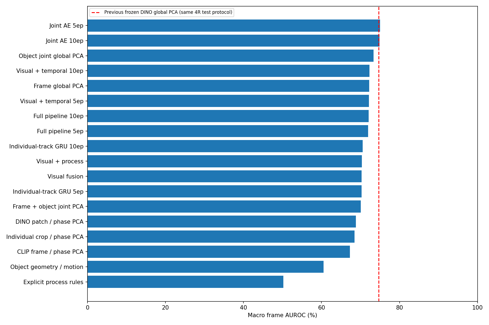

# Normal-only Industrial Video Anomaly Detection

IPAD 정상 영상으로 기준을 만들고, 새 영상의 화면·객체·움직임·공정 순서가 정상 기준에서 벗어나는지 비교하는 **학부 연구용 파일럿**입니다.

**완료 범위:** IPAD R01~R04, 18가지 점수 구성, 72개 장면별 평가, 5/10에포크 학습 체크포인트, 독립 MP4 추론과 시연 자료.

> 전체16 장면 평가, 새로운 공장의 범용성, 공정 단계 정답 정확도, 불량 위치 정확도, 상용 배포 성능을 검증한 프로젝트는 아닙니다. 복잡한 결합이 가장 좋은 결과였다고 주장하지 않습니다.

## 결과부터 보기

- [실험 결과 설명](output/full_pipeline_20261004/완성결과_읽어주세요.md)
- [18개 방법 설명](docs/METHODS.md)
- [장면별 72개 결과](output/full_pipeline_20261004/전체비교_72개.csv)
- [방법별 평균 18개](output/full_pipeline_20261004/방법별평균_18개.csv)
- [실제 입력 추론 검증](output/full_pipeline_20261004/실제추론_검증.json)
- [학습 모델·시연 다운로드](https://github.com/b-jongwon/ipad-normal-video-ad/releases/tag/pilot-v3-20261004)

| 구성 | 평균 프레임 AUROC | 정상 테스트 프레임 오경보율 |
|---|---:|---:|
| Joint feature AE, 5ep | 75.01% | 16.30% |
| Joint feature AE, 10ep | 74.87% | 16.91% |
| Object joint global PCA | 73.32% | 12.08% |
| Visual + temporal, 10ep | 72.31% | 18.57% |
| Full pipeline, 10ep | 72.08% | 18.34% |
| Visual fusion | 70.31% | 17.43% |
| Explicit process rules | 50.22% | 0.23% |

4장면 결과의 단순 평균입니다. AUROC는 정확도가 아닙니다. 기존 동결 DINO 전역 PCA 기준 모델은 동일한 4장면 평가에서 74.66%였습니다. 이번 18개에서 관측상 가장 높은 AE5를 같은 테스트로 최종 선택까지 검증한 것은 아닙니다.



## 시스템 구조

정상 학습: 정상 녹화 → 객체·단계 규칙 후보 → 검출/추적 → 동결 특징 → 학습한 단계 분류기·정상 PCA 공간·AE·GRU.

새 영상 추론: 4프레임 간격 입력 → GroundingDINO + ByteTrack → CLIP 화면/개별 객체 특징 + DINO 패치 → 단계·시각·시계열·공정 점수 → 경고와 후보 위치.

| 모듈 | 사용 방식 |
|---|---|
| GPT-4.1-mini | 정상 학습 녹화3편 × 12장으로 객체·단계·전환 후보 생성. 추론 중 API 호출 없음 |
| GroundingDINO tiny | 동결 객체 검출, 매 선택 프레임 실행 |
| Supervision ByteTrack | 객체 종류별 추적, 개별 ID·bbox·이동량, 녹화 경계에서 초기화 |
| CLIP ViT-B/16 | 동결 시각 encoder. 전체 화면512 + 개별 crop512 + 위치·이동6 = 객체별1030차원 |
| DINOv2 ViT-S/14 | 동결 중간4/7/10층 패치 특징. 224px, 16×16 패치 잔차 지도 |
| Phase MLP | 정상 키프레임의 약한 단계 라벨로10ep 학습. 불확실한 단계는 unknown |
| PCA normal subspaces | 정상 학습 특징으로 화면/객체 종류/단계별 공간 추정. 표본 부족 시 전역 공간 사용 |
| Joint feature AE | 정상1030차원 특징 재구성, 5/10ep 저장 |
| Individual-track GRU | 같은 ID의 과거8관측으로 현재 특징 예측, 5/10ep 저장 |
| Process monitor | 순서 누락·역순·필수 객체 누락·지연 검사. 사람이 확정한 규칙은 아님 |

현재 `full_pipeline`은 보정된 시각 점수60% + GRU20% + 공정 규칙20%입니다. AE 점수는 별도 비교이며 이 조합에는 포함되지 않습니다. CLIP 시각 encoder를 사용하므로 “추론에서 외부 GPT API가 없음”과 “VLM을 전혀 사용하지 않음”을 구분해야 합니다.

## 검증 환경

- Windows, Python3.12.10, RTX4060 8GB.
- PyTorch2.7.1+cu128, torchvision0.22.1+cu128, Transformers4.57.6.
- Backbone 동결; 특징 추출기를 파인튜닝한 결과가 아닙니다.
- 저장 모델의 첫 테스트 녹화 순차 추론과 오프라인 점수 일치 검증: 4장면 통과.
- 기능 테스트12개, 기존 데이터 테스트4개 통과.
- 원본 프레임 재검출 추론4건 + 실제 MP4 입력1건, 출력 영상 디코딩 검증 통과. 모든 테스트 녹화의 원본 재추론 검증은 아닙니다.

## 설치와 독립 추론

NVIDIA CUDA GPU를 사용하는 구현입니다. CPU 대체 실행은 검증하지 않았습니다. 아래는 PowerShell 예시이며, 다른 GPU/드라이버는 맞는 PyTorch 배포판을 확인하세요.

```powershell
python -m venv .venv
& .\.venv\Scripts\python.exe -m pip install torch==2.7.1 torchvision==0.22.1 --index-url https://download.pytorch.org/whl/cu128
& .\.venv\Scripts\python.exe -m pip install -r local_experiments\requirements.txt
& .\.venv\Scripts\python.exe -m pip install supervision==0.27.0 --no-deps
& .\.venv\Scripts\python.exe -m pip install defusedxml==0.7.1
```

Supervision은 배포 메타데이터에서 `opencv-python`을 요구하지만, 이 환경은 동일한 `cv2` API의 `opencv-python-headless4.11.0.86`을 사용합니다. 두 OpenCV 배포본의 중복 설치를 피했습니다. 따라서 `pip check`에는 의존성 이름 차이가 남으며, ByteTrack 런타임은 별도로 검증했습니다.

1. Releases의 `IPAD_code_models_v3.zip`을 다운로드합니다.
2. **ZIP에서 `local_experiments/runs/full_pipeline_v3/`만** 이 저장소의 같은 경로로 복사합니다. 공개된 소스와 별도로 모델만 복사하는 방식입니다.
3. 공식 사전학습 가중치를 처음 한 번 다운로드합니다. 인터넷이 필요합니다.

```powershell
& .\.venv\Scripts\python.exe -m local_experiments.full_pipeline.prepare_models
```

4. 이후 같은 공정의 MP4를 입력합니다. 이 추론에는 API 키와 IPAD 정답 파일이 필요 없습니다.

```powershell
& .\.venv\Scripts\python.exe -m local_experiments.full_pipeline.infer --scene R01 --video 'D:\path\video.mp4' --out 'output\my_video'
```

`demo.mp4`, `inference.jsonl`, `summary.json`이 생성됩니다. R01 모델을 다른 공정 영상에 적용해도 범용성이 보장되지 않습니다. 새 공정 폴더 자동 학습 UI는 제공하지 않습니다.

## 데이터와 재학습

- 원본 [IPAD](https://ljf1113.github.io/IPAD_VAD/)는 별도로 받아야 합니다. 원본 ZIP과 사전학습 가중치는 이 저장소에 없습니다.
- 정상 녹화의80% train / 20% normal validation, seed0, 4프레임 간격. 프레임을 섞어서 분리하지 않습니다.
- 이상 라벨은 평가용. 점수 보정·q99 임계값은 정상 검증으로 결정하고 결합 가중치는 고정했습니다.
- R02 테스트12·13·14는 프레임 수와 정답 길이가 달라 제외했습니다.
- 장면별 정상 학습 표본: R01 1564, R02 3562, R03 2968, R04 1949. 총10043개입니다.
- 단계 라벨은 정상 키프레임의 대략적인 후보입니다. 모든 단계를 무라벨로 자동 발견한 것은 아닙니다.

[재현 범위와 학습 절차](docs/REPRODUCIBILITY.md)를 먼저 확인하세요. 제공 모델을 받은 폴더에서는 `train`이 기존 결과를 재사용하므로, 새 학습은 모델을 복사하지 않은 별도 체크아웃에서 진행해야 합니다.

## 알려진 한계와 다음 과제

- R01 배경 계측기의 객체 오검출이 관찰됐습니다. 전체 구성의 R01 정상 프레임 오경보율은67.53%입니다. 정상 자료에서 ROI/객체 정의 검증이 우선입니다.
- 생성 규칙은 사람이 확정한 공정 정답이 아닙니다. R03은 장난감 지게차 실험입니다.
- 객체/단계/픽셀 정답이 없어 위치·공정 의미 정확도를 측정하지 못했습니다. 빨간 bbox와 열지도는 이상 후보이지 검증된 결함 위치가 아닙니다.
- 원본 FPS 미확인: 공정 지연은 관측 수 기준. 미리보기10 FPS는 추론 처리 속도가 아닙니다.
- 단계별 공간이나 규칙 추가가 항상 유리하지 않았습니다. 독립 보류 데이터에서 모델 선택을 검증해야 합니다.
- 전체16 장면, 새 공정의 few-shot 적응 비용, 실제 현장 오경보·지연 평가가 남아 있습니다.

## 보안·출처

API 키, `.env`, 개인 키 메모장, 원본 데이터, 특징 캐시, 가상환경을 업로드하지 않습니다. 모델/시연 ZIP은 크기 때문에 Git 이력이 아닌 비공개 저장소 Releases에 첨부합니다. 별도 공개 배포 라이선스를 임의로 지정하지 않았으며, 공개 전에는 데이터·사전학습 모델의 이용 조건을 확인해야 합니다.

[사용한 모듈·논문과 참고 저장소](docs/SOURCES.md). SubspaceAD 아이디어를 영상/단계 조건에 적용한 구현이며 원 논문 전체 재현 또는 새로운 독창적 방법을 주장하지 않습니다.
