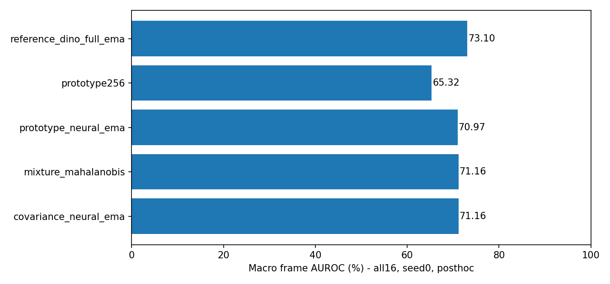
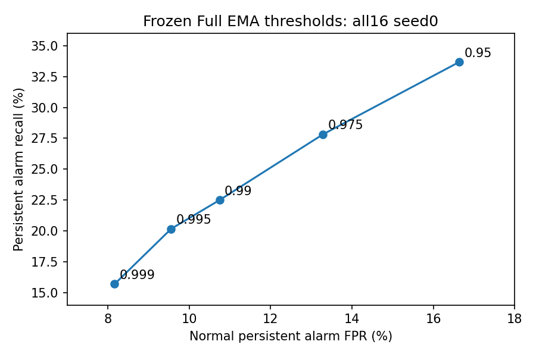

# E07 — 가능한 고도화와 미입증 항목의 후속 검증

**2026-10-06 후속 경로:** 실제 이미지 입력 VLM의 테스트 phase/state/일치 추정을 추가한 새 실험은 [MENTOR_DIRECT_VLM](MENTOR_DIRECT_VLM.md)에 정리했다. 아래 E07 결과/기존v3를 그 경로와 혼동하지 않는다. 새 Full은 동일조건 global 기준보다 낮아 기존 기본 모델을 교체하지 않았다.

2026-10-05, 기존 모델/결과를 보존한 별도 `improvements_20261005` 실행이다. **성능이 개선되었다고 보고하기 위한 실험이 아니라, 실제로 개선되는지를 검사했다. 이번 후보는 기존 화면 복합 모델을 전반적으로 넘지 못해 기본 모델을 교체하지 않았다.**

## 1. 무엇을 추가했나

| 묶음 | 실제 추가 수행 | 아직 주장할 수 없는 것 |
|---|---|---|
| LLM 모델 선택 | GPT-4.1-mini와 GPT-5.4를 정상 이미지에서 생성·학습·평가 | 강한 LLM이 모든 장면에서 좋다는 주장 |
| 정상 메모리 | 16장면, CLS 64/256 프로토타입·차분 메모리·3 fit 녹화·신경망 결합 | 팀원의 IPAD/DINO-B14/patch 메모리 재현 |
| 정상 공분산 | 16장면, shrinkage global/시각 상태별 공분산·신경망 결합 | 상태가 사람 공정 phase라는 주장 |
| 실제 backbone 추가 학습 | R01/R04 DINO 마지막 block+layernorm 1,776,000개 parameter | detector/CLIP 전체 fine-tuning 완료 |
| 정상 임계치 절충 | q95/97.5/99/99.5/99.9, 총1,280 profile행 | q99면 미래 현장 오경보가1%라는 보장 |
| 독립 저장 추론 | 32개 memory/covariance 모델,6,558 cached-feature 관측 재현 | 새32개 아키텍처/장시간 raw-camera 검증 |
| live guard | v3에 선택적으로 연결하는 `GuardedBundle`,161관측 재현 | guard 자체가 AUROC를 올렸다는 주장 |
| 신규 공정 입력 | normal MP4 fit/cal manifest → frozen DINO → 메모리 fit → 파일 추론 | 새 공장 zero-shot/정상성 자동 정의 |

추가 gradient 학습은 phase MLP4개와 DINO 일부 층2개다. KMeans/PCA/공분산에는 epoch가 없다. 기존232헤드를 다시 전부 학습한 것도 아니고, 통계 모델을232개 새 신경망으로 세는 것도 아니다.

이번 결과는 **모두 이전에 본 IPAD에 대한 사후 개발 평가**다. 정상 녹화를 분리하고 모델/임계치를 새 평가 전에 고정했더라도, 개발자가 이미 본 테스트를 독립 최종 시험이라고 부를 수 없다. 정상-only 방식은 유지했다.

## 2. 강한 LLM을 정말 사용했나

사용했다. 이미지 입력 및 구조화 출력을 지원하는 GPT-5.4 snapshot을 가격·기능 확인 후 선택했다. 모델 학습이 아니라 **정상 공정 설명/약한 라벨 후보 생성 API**다. [OpenAI 공식 모델 문서](https://developers.openai.com/api/docs/models/gpt-5.4), [이미지 입력 문서](https://developers.openai.com/api/docs/guides/images-vision).

- 기존 모델: `gpt-4.1-mini-2025-04-14`.
- 강한 후보: `gpt-5.4-2026-03-05`, reasoning `none`. 고비용 최고 reasoning 설정까지 탐색한 것은 아니다.
- 각 호출: 정상3개 녹화 × 시간순12개 이미지,최대360px,동일 JSON schema와 최대5,000 출력 token.
- 기존 `review_context.py`의 고정 SPECS로 새 답변을 덮어쓰지 않았다. 생성된 답변의 phase/약한 라벨이 실제 MLP/PCA 학습에 들어갔다.
- 검출/추론은 로컬 모델이다. 추론할 때 GPT를 매 프레임 부르는 구조로 바꾸지 않았다.

### 2.1 실패도 기록했다

1차 sandbox 전송4개는 OpenAI 응답 전에 연결 실패했다. 같은 요청을 네트워크 허용 환경에서 각1회 실행해 응답4개를 받았지만,2개는 grammar 검증을 통과하지 못했다. **이2개를 나쁜 AUROC 결과로 계산하지 않는다.** 검증 실패 이유를 상세히 저장하기 전 코드였으므로 처음2개 응답의 정확한 위반 항목을 지금 단정할 수 없다. receipt에 요청/응답 model,token,status는 남아 있다.

유효한 v1 arms는 R01 mini와 R04 strong뿐이다. 서로 장면이 달라 **두 모델의 직접 우열 비교로 쓰지 않았다.** 같은 구조로10epoch phase MLP를 학습해 각각 global/hard/soft 점수는 평가했다.

그 후 **별도 v2 R01 비교**를 고정했다. clip 문자열 leading zero를 schema enum으로 보존하고, 객체2~4/phase2~6/증거36개를 제약했다. prompt도 양쪽에 동일하게 수정했다. v1과v2는 생성 조건이 달라 한 표에서 모델 효과만 비교하면 안 된다. v2의 두 모델은 같은 이미지·prompt·schema를 받았다.

### 2.2 v2 matched R01 결과

| 구성 | AUROC | AP | 경고 FPR | 경고 recall |
|---|---:|---:|---:|---:|
| no-LLM CLIP global PCA | 69.74% | 45.51% | 33.12% | 58.84% |
| mini grammar → hard phase PCA | 61.95% | 38.39% | 18.83% | 38.91% |
| strong grammar → hard phase PCA | 67.01% | 42.66% | 60.55% | 95.50% |
| mini grammar → soft phase PCA | 61.37% | 41.73% | 50.32% | 64.63% |
| strong grammar → soft phase PCA | 65.83% | 40.94% | 54.55% | 85.21% |

강한 모델은 mini의 hard-routing AUROC를 약5.06pp 높였지만, no-LLM global보다 낮고 오경보가 훨씬 많다. whole-recording bootstrap500회에서 strong−mini AUROC 차이CI는 **[-4.11,+12.57]pp**, strong−global은 **[-7.92,+4.12]pp**다. 한 장면·한 생성씩이므로 생성 변동/범용 기여가 입증되지 않았다.

이 비교는 **동결 CLIP 화면 특징 → phase MLP → frame PCA의 좁은 경로**다. 각 모델 vocabulary로 전체 test 객체를 다시 검출하고 객체 GRU까지 학습한 Full pipeline 대조가 아니다. 새 noun을 활용해 정상 keyframe에서 GDINO도 실제 실행했지만, 이는 bbox 후보 진단이다. mAP/IDF1/정확한 역할 분류를 주장하지 않는다.

약한 라벨은 keyframe과 가장 가까운 정상 frame에 확장했다. phase 의미의 정확도는 사람 GT가 없고, phase confidence나 학습 라벨 일치율을 사람 정확도로 부르면 안 된다. mini5단계/strong4단계라는 차이 자체도 생성 결과다.

참고: v1 mini R01 soft 방식은72.32%로 같은 global69.74%보다 높은 점수지만 FPR54.55%다. v2에서는 그 현상이 재현되지 않았다. 이 결과를 감추지도, LLM의 안정적 이득이라고 일반화하지도 않는다.

## 3. 정상 메모리와 시계열

동결 DINO-S/14의 CLS384를 사용했다. 정상 fit 특징만 MiniBatchKMeans로64/256개 prototype을 만들고 cosine nearest distance를 계산한다. patch bank를 사용하는 [PatchCore 논문](https://arxiv.org/abs/2106.08265)에서의 정상 메모리 아이디어를 참고했지만, **이번 구현은 CLS prototype이며 원 논문/팀원/IPAD 공식 재현이 아니다.**

- `prototype64`, `prototype256`: 현재 화면의 정상 대표점 거리.
- `prototype_fewshot3`: 첫3 fit 녹화로256개 이내 대표점. normal tune/cal 녹화는 별도로 필요하다.
- 차분128 prototype: 현재−직전 CLS의 제곱 Euclidean 거리. 녹화 시작은 visual 점수로 대체한다.
- `prototype_motion`: 정상 scale로 정규화한 visual70% + 차분30%.
- `prototype_neural`: visual50% + 기존 DAE30% + 기존 GRU20%.
- 두 결합의 EMA alpha.4는 과거 방향만 사용하고 녹화 경계에서 reset한다.

### 같은 normal split / seed0 / all16

| 방법 | AUROC | AP | 경고 FPR | 경고 recall |
|---|---:|---:|---:|---:|
| 기존 화면 Full EMA | **73.10%** | **44.89%** | 10.75% | **22.50%** |
| prototype256 | 65.32% | 39.35% | 8.67% | 15.33% |
| prototype + DAE/GRU + EMA | 70.97% | 43.04% | 10.32% | 18.88% |
| 상태 혼합 공분산 | 71.16% | 44.28% | 8.11% | 15.38% |
| global 공분산 + DAE/GRU + EMA | 71.16% | 43.15% | 10.50% | 20.01% |

기존3seed 평균73.09%와 위 seed0 73.10%는 다른 집계다. **73.09→73.10 성능 향상이라고 쓰면 안 된다.**

단순 차분 메모리+EMA는57.20%,3-fit-recording prototype은48.10%였다. 시계열을 추가하면 무조건 좋아지는 것이 아니며, normal 대표점을 줄이면 빠르지만 정상 다양성을 놓칠 수 있다. 팀원의 표현/backbone/prototype/시간 모듈과 동일한 코드·분할이 아니므로 팀원 결과를 반박하는 공식 재현 실험도 아니다.

메모리 후보가 연속 정상 변화에 약하다는 가설로 bounded 공분산 후속을 별도 고정했다. LedoitWolf shrinkage normal covariance를 global/시각군집별로 fit하고 Mahalanobis 점수를 계산했다. 시각 상태별 최소 잔차는 강제 phase routing을 피하지만, 다른 상태의 기준으로 이상을 정상처럼 받아들일 위험도 있다. 이 후보도 기존 복합 모델을 넘지 못했다.

주요 paired bootstrap: prototype neural EMA−기존 Full EMA all16 **[-2.91,-1.50]pp**, covariance neural EMA−기존 Full EMA **[-2.76,-1.21]pp**. CI는 동일 장면/seed 조건,사후 탐색,다중비교 보정 없음이다. 새 공장 일반화 증거가 아니다.



## 4. backbone을 실제로 학습했다

R01/R04에서 DINOv2 마지막 encoder block과 final layernorm,장면당**1,776,000개 parameter**를 AdamW로 업데이트했다. CLIP/GDINO는 여전히 동결이다. [DINOv2 논문](https://arxiv.org/abs/2304.07193)의 전체 pretraining을 재현한 것은 아니다.

- 목표: brightness/contrast를 각각.9~1.1로 약하게 바꾼 정상 이미지의 student CLS가 원본 이미지의 frozen teacher CLS와 맞도록 MSE 학습.
- crop/flip/순서 뒤집기는 하지 않았다. 색·위치 불량의 정의를 파괴할 수 있기 때문이다. 작은 조명 변화도 실제 결함을 숨길 가능성이 있어 baseline을 보존했다.
- lr5e-5,weight decay1e-4,batch16,gradient clip1,AMP. 최대12/min3/patience3.
- 정상 tune의 **고정 조명 augmentation loss**로 checkpoint를 선택했다. test AUROC로 epoch를 고르지 않았다.
- R01은5epoch 실행,best2. R04는4epoch 실행,best1. 최소 실행 epoch와 best checkpoint epoch는 다른 숫자다.
- 선택 weights의 초기 대비 L2 변화는 R01 약.2116,R04 약.1514. 가중치가 실제 변경됨을 확인했다.

| 장면 | 동결 PCA AUROC | 추가 학습 PCA AUROC | 해석 |
|---|---:|---:|---|
| R01 | 81.14% | 80.57% | 약.57pp 하락 |
| R04 | 76.56% | 76.33% | 약.23pp 하락 |

새 feature 재추출 후 동일 normal fit/cal로 PCA를 다시 맞췄다. Full AE/GRU를 fine-tuned 특징 위에 새로 전부 학습한 것은 아니다. **“backbone fine-tuning을 아직 실행하지 않았다”는 상태는 해소했지만, “fine-tuning이 유리하다”는 주장은 입증되지 않았다.** 더 많은 epoch를 돌릴 근거로 삼지 않았다.

## 5. 오경보를 줄이는 것과 모델 성능 향상은 다르다

기존 Full EMA의 정상 cal threshold만 바꿔 본 all16 seed0:

| 정상 quantile | 경고 FPR | 경고 recall | 경고 F1 |
|---|---:|---:|---:|
| q95 | 16.64% | 33.68% | 31.87% |
| q99 기본 | 10.75% | 22.50% | 24.07% |
| q99.9 | 8.17% | 15.70% | 17.03% |

q99.9로 오경보는 줄지만 이상을 더 놓친다. 기본 threshold는 교체하지 않았다. 정상 cal에서의1% 목표가 test 정상 FPR1% 보장은 아니다. train/cal/test 정상의 조건 차이와 상관된 관측이 존재한다. threshold를 변경해도 AUROC가 좋아지는 것은 아니다.



사용자는 사업 목표(미탐/오탐 비용,허용 경고,응답 지연)를 정해야 한다. test F1이 제일 큰 threshold를 골라 같은 test로 다시 최고 성능이라고 보고하지 않는다.

## 6. 구현 안전성과 새로운 정상 영상 입력

### Live guard

`GuardedBundle`은 이전 v3 `Bundle`을 감싸 기존 점수/heatmap은 보존하고 판단 상태를 추가한다.

- unknown phase → 공정 평가 불가.
- 사람이 승인하지 않은 규칙 → 검증되지 않은 rule 후보.
- Full score 경고 없음 + 미검증 공정 → **공정이 정상이라는 뜻이 아님**.
- nonfinite score → 판정 불가.
- 어떤 경우에도 `certified_normal=True`를 자동 출력하지 않는다.

기본 v3 CLI의 출력 의미를 몰래 바꾸지 않았다. 사용하려면 새 wrapper를 선택해야 한다. R01/R04 첫 test의161관측 재현에서 이전 점수 오차는 최대약.001633,모든 normal certification0개였다. FP16 입력과 GPU 축약 순서 차이 때문에 bitwise 동일하다고 주장하지 않는다. Guard는 상태를 구분하는 개선이며 AUROC 개선은 아니다.

### 새로운 정상 MP4에 적응시키는 별도 CLI

`adapt.py`는 기존 IPAD clip ID 없이 입력한다. normal fit2개 이상,calibration2개 이상의 서로 다른 녹화를 manifest에 지정한다. byte hash로 복제/중복 녹화를 막는다. 사용자가 정상이라고 정한 영상이라는 전제가 필요하다.

```json
{
  "normal_fit_videos": ["normal_fit_01.mp4", "normal_fit_02.mp4"],
  "normal_calibration_videos": ["normal_cal_01.mp4", "normal_cal_02.mp4"]
}
```

```powershell
.\.venv\Scripts\python.exe -m local_experiments.improvement_pipeline.adapt train --manifest .\normal_manifest.json --out .\local_experiments\runs\new_process_v1
.\.venv\Scripts\python.exe -m local_experiments.improvement_pipeline.adapt infer --model .\local_experiments\runs\new_process_v1 --video .\input.mp4
```

사전학습 DINO를 준비하고 정상 영상에서 특징을 추출한 뒤 메모리와 threshold를 fit한다. MP4 새 입력을 다룰 수 있는 **frame appearance 경로**이며 detector/phase/GRU가 포함된 Full 적응은 아니다. 기존 공정과 다른 모델 경로임을 명시한다. inference artifact에는 불량 후보/점수는 있지만 정상 보증/공정 순서 판정은 없다.

4개의 서로 다른 IPAD 정상 녹화에서 각24 prefix frame을 MP4로 재인코딩해96관측 fit/cal,24관측 추론 smoke를 실행했다. container FPS25는 fixture값이고 원 IPAD FPS가 아니다. decode→feature→fit→saved file inference의 실행 확인일 뿐, **새 공장·충분한 데이터·정확한 이상 탐지·전체 적응 시간 benchmark를 입증한 것은 아니다.** calibration 녹화를 smoke 추론에 재사용했으므로 그24개를 independent test로 평가하지 않는다.

## 7. 무엇을 아직 해결해야 하나

1. **객체/phase human GT:** 정상48표본 검토와 연속 phase annotation,역할 bbox/ID 검증. 새 LLM 출력이나 detector confidence를 정답으로 삼을 수 없다.
2. **객체 지각 개선:** R01 제품을 계측기로 잘못 보던 문제를 human normal bbox 기반 detector 소규모 fine-tuning 또는 다른 detector/고해상도 patch 표현으로 교정하고,전체 객체 특징/헤드를 다시 fit해야 한다. 이번에는 수행하지 않았다.
3. **실제 공정 오류 GT:** 누락/순서/정지의 실제 영상에 종류별 recall·시간 지연. symbolic oracle나 뒤집은 영상은 보조 검증이다.
4. **patch/multi-layer 표현 비교:** CLS prototype을 시도했을 뿐이다. DINO-B/14나 고해상도 patch bank가 좋아질지는 동일 조건으로 새 실험이 필요하다. 기존 팀원 숫자를 우리 결과로 재사용하면 안 된다.
5. **LLM 기여의 확장 검증:** 같은 생성 조건 여러 seed,여러 장면,사람 설정 baseline,새 vocabulary 전체 detection/trajectory 재학습과 설정시간 비교. 지금 R01 phase-only pilot은 부분 증거다.
6. **새 현장 holdout:** 다른 정상 카메라/조명/제품에서 fit/cal 후 완전히 보류한 정상·이상 영상으로 검증. 코드 이식성과 성능 일반화는 다르다.
7. **상용 운영:** 신뢰 가능한 정상 범위,알림 비용 기준,장시간 drift/오경보,추론 FPS/지연,라이선스·보안 검토.

따라서 다음 우선순위는 **더 큰 GPT를 계속 결제하는 것보다 정확한 정상 역할/단계 정의와 영상 holdout을 만드는 것**이다. 현재 최선의 기존 화면 DAE+GRU+EMA를 기준으로 고정하고,새 표현/객체 모듈이 의미 있게 기여하는지를 다음 버전에서 검증하는 것이 타당하다. 향상을 보장할 수는 없다.

## 8. 재현·비용·공개 범위

새 코드: [improvement_pipeline](../local_experiments/improvement_pipeline/). 기존 local feature cache와 모델을 재사용하는 실험은 앞 단계 재현 자료를 먼저 준비해야 한다. 공개 저장소에 전체 cache/weights가 포함되어 있지는 않다.

```powershell
.\.venv\Scripts\python.exe -m local_experiments.improvement_pipeline.memory
.\.venv\Scripts\python.exe -m local_experiments.improvement_pipeline.covariance
.\.venv\Scripts\python.exe -m local_experiments.improvement_pipeline.finetune
.\.venv\Scripts\python.exe -m local_experiments.improvement_pipeline.stream
.\.venv\Scripts\python.exe -m local_experiments.improvement_pipeline.verify
.\.venv\Scripts\python.exe -m local_experiments.improvement_pipeline.tests
```

LLM 명령은 **유료**이며 정상 evidence/cache와 누적 budget ledger가 필요하다. 실패를 반복 재시도하지 않는다. 정상 schema v2 명령은 `python -m local_experiments.improvement_pipeline.llm --schema-v2 --detect`이고,실행 환경이 API 연결을 허용해야 한다. 새로운 조직/project key를 발급해도 credit이 생기거나 예산이 리셋되지 않는다.

이번 completed API 응답6개 중 grammar accepted4개,검증 실패2개다. 추가 token 가격 추정약$0.0898,기존 포함 누적**약$0.1073**이다. 실패 전송을 보수적으로 포함한 예약액은**$3.875/$4**다. 예약액은 실제 지출이 아니며,실제 청구는 계정 내역이 기준이다. 새 키·기존 키·개인 env 파일은 공개하지 않는다.

수치 원본: [전체 생성 표](../output/improvements_20261005/NUMERIC_RESULTS.md), [완료 규모](../output/improvements_20261005/completion_summary.json), [모델 재현](../output/improvements_20261005/serialized_roundtrip.json), [임계치1280행의 memory 원본](../output/improvements_20261005/threshold_profiles.csv). covariance profile은 별도 JSON이다.

새 업로드에는 코드,문서,수치 metadata,학습 loss,사람 검증되지 않았다고 명시한 bbox 숫자,데이터 pixels 없는 성능 그래프만 포함한다. 정상 MP4 fixture·원본 데이터·weights·feature arrays·API 키/개인 경로 파일은 제외한다. 역사적 파일은 보존했다.
