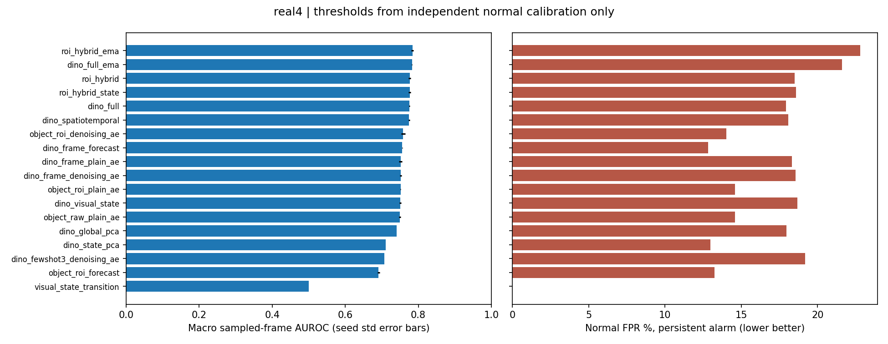
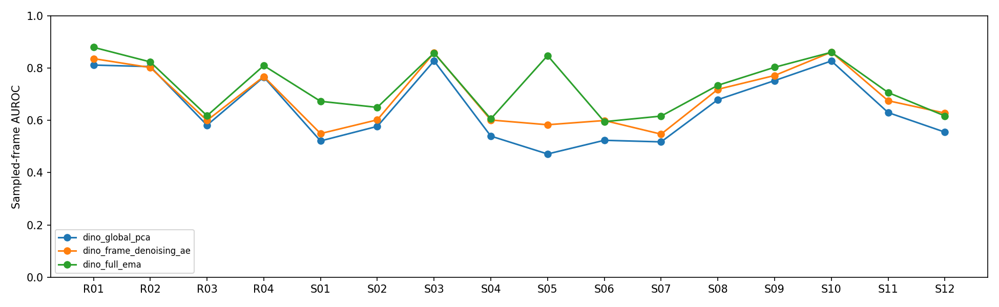
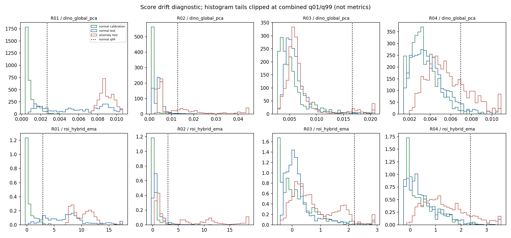

# IPAD 정상 영상 이상 탐지 고도화 실험 — 2026-10-05

## 한눈에 보기

정상 영상으로만 학습하고, 별도의 정상 영상으로 학습 종료와 경고 기준을 정한 뒤 이상 영상에서 평가했다. 이전 결과는 보존했다. 실제 촬영 4개 + 합성 12개, 초기값 3개(seed 0/1/2)를 비교했으며 학습 헤드 **208개**, 장면×시드×방법별 평가 **580개**를 만들었다. 이는 서로 완전히 다른 580개의 새 아키텍처라는 뜻이 아니다.

추가 유료 API 호출은 **0회**. DINOv2, CLIP, GroundingDINO 본체는 고정이고, 정상 특징을 재구성하거나 예측하는 작은 신경망을 직접 학습했다. 대형 모델 전체를 파인튜닝한 것은 아니다.

핵심 결과: 16개 장면 공통 화면+시계열+상태+EMA AUROC **73.09%**, 동일 분할 PCA 기준 **64.91%**. 실제 촬영 화면/객체 복합형 AUROC **78.39%**, 지속 경고 FPR **22.80%**로 오경보 문제는 남았다. 추가 탐색 crop-only AE는 FPR **3.43%**, recall **24.74%**. crop-only 복합형+EMA는 AUROC **75.80%**, FPR **8.57%**, recall **33.91%**. 뒤 두 결과는 R 결과 확인 후의 탐색 실험이며 오경보 감소와 미탐 증가를 함께 봐야 한다. 서로 같은 경고 정의·정상 q99 기준에서 비교했고, '완벽한 최적 모델'이라고 포장하지 않는다.

주 실험 208개와 추가 탐색 24개를 합쳐 총 **232개 학습 헤드**다. 공정 단계 정답, 객체/픽셀 불량 위치 정확도, 새 공장 범용성은 아직 검증하지 않았다.

## 에포크를 어떻게 정했나?

- 최대 100, 최소 10에포크. 정상 tuning 손실에서 0.5% 이상 개선이 10에포크 동안 없으면 조기 종료.
- 실제 선택은 **12~100에포크**, 중앙값 **92.5**. 학습 마지막이 아니라 정상 tuning 손실이 가장 낮은 가중치를 저장했다.
- 121개는 정상 검증 정체로 종료, 87개는 실험 상한 100에 도달했다. 상한에 도달한 모델은 완전히 수렴했다고 주장할 수 없다.
- 정상 재구성 손실이 낮아지는 것과 이상 탐지 AUROC 상승은 별개다. 테스트 AUROC가 가장 높은 에포크로 다시 고르지 않았다.
- 기본 AE의 학습 손실은 MSE, 잡음 제거 AE/GRU는 SmoothL1이다. 손실 곡선의 절댓값으로 서로 다른 방법의 우열을 정하면 안 된다.
- 5/10/25/50/100 중 실제 도달한 체크포인트만 저장. `epoch_diagnostics.csv`는 사후 비교용이며 선택 근거가 아니다.


## 데이터 흐름: 팀원에게 이렇게 설명하면 된다

1. 동영상의 순서를 유지하며 4프레임마다 1개를 읽는다. 영상 한 편이 서로 다른 분할에 섞이지 않도록 한다.
2. 기존 정상 학습 후보의 약 80%는 **fit**: 가중치를 학습한다. 나머지 약 20%는 **tune**: 언제 멈출지 정한다. 별도 정상 **calibration** 영상은 경고 기준 q99와 점수 단위만 정한다.
3. DINOv2 ViT-S/14에서 화면 특징 384차원을 추출한다. 실제 촬영 장면에서는 이전 정상 영상에서 정한 객체 vocabulary로 GroundingDINO + ByteTrack + CLIP 객체 특징도 재사용한다.
4. 기본 AE, 잡음 제거 AE, 과거 8개 관측으로 현재 특징을 예측하는 GRU를 정상 데이터로 학습한다. GRU는 미래 프레임을 보지 않는다.
5. 정상 화면 특징을 PCA+KMeans로 4개 **시각 상태**로 묶어 상태 전이의 드묾을 비교한다. 각 시각 상태별 정상 PCA 부분공간도 별도로 비교한다. 이 상태는 사람이 확인한 grasp/release 등의 공정 phase가 아니다. 상태가 불확실하면 전체 정상 부분공간으로 돌아간다.
6. 단독 방법, 고정 비율 복합형, 인과적 EMA 평활화를 비교한다. 테스트 정답으로 조합 비율을 조정하지 않았다.
7. 정상 calibration q99를 넘으면 프레임 경고, 3번 연속 높으면 지속 경고를 켜고 2번 연속 낮으면 끈다. 과거에 소급해서 이상 프레임을 늘리지 않는다.
8. 모든 장면의 모델·점수·기준을 파일 해시로 봉인한 뒤 테스트 이상 정답을 평가에 사용한다. 그 이전에도 파일 목록 정합성을 위해 라벨 길이와 0/1 형식을 확인하며 파일을 로드하지만, 이상 값 자체를 학습·분할·종료·임계값·가중치 선택에 사용하지 않았다.

정상 학습 영상 3개 실험도 포함했다. 다만 정상 tune/calibration 영상은 **추가로** 사용하므로 '총 3개 영상만 필요'한 실험은 아니다. 장면마다 별도 모델을 학습했으므로 하나의 모델이 모든 신규 공장에 즉시 적용된다는 검증도 아니다.

## 방법별 성능

모든 값은 **4프레임 간격으로 샘플링한 관측** 기준. 장면별 동등 가중 평균을 먼저 계산하고 3개 seed를 평균했다. 서로 다른 장면의 점수를 그냥 합쳐 하나의 ROC를 계산하지 않았다. `group_summary.csv`에 seed 간 표준편차도 있다. few-shot은 seed 0만 있다.

### 실제 촬영 4개 장면

| 방법 | AUROC | AP | 경고 F1 | 경고 정상 오경보율 | 이상 구간 탐지율 |
|---|---:|---:|---:|---:|---:|
| 위 객체 복합형 + 점수 평활화 | 78.39% | 67.59% | 34.71% | 22.80% | 52.41% |
| 위 복합형 + 점수 평활화 | 78.24% | 70.14% | 43.99% | 21.59% | 62.54% |
| 객체 AE + 전체 화면 AE + 객체 GRU | 77.65% | 66.93% | 34.80% | 18.50% | 48.80% |
| 객체 복합형 + 시각 상태 전이 | 77.64% | 66.86% | 35.39% | 18.59% | 50.09% |
| AE + 예측 + 시각 상태 전이 | 77.56% | 68.79% | 37.78% | 17.91% | 53.97% |
| AE + 예측 | 77.49% | 68.72% | 37.58% | 18.08% | 54.61% |
| 정상 ROI 객체 + 잡음 제거 AE | 75.84% | 66.12% | 33.22% | 14.01% | 41.41% |
| DINO + GRU 예측 | 75.60% | 66.99% | 33.48% | 12.83% | 46.61% |
| DINO + 기본 AE | 75.16% | 66.93% | 38.61% | 18.32% | 54.76% |
| DINO + 잡음 제거 AE | 75.13% | 66.06% | 38.90% | 18.57% | 53.80% |
| 정상 ROI 객체 + 기본 AE | 75.13% | 65.26% | 30.55% | 14.60% | 38.17% |
| AE + 시각 상태 전이 | 75.11% | 66.03% | 38.56% | 18.66% | 53.48% |
| 기존 객체 특징 + 기본 AE | 74.97% | 65.09% | 32.16% | 14.59% | 42.19% |
| DINO + 정상 부분공간(PCA) | 74.10% | 63.85% | 38.43% | 17.95% | 52.03% |
| 시각 상태별 정상 부분공간(PCA) | 71.10% | 62.40% | 29.89% | 12.97% | 39.98% |
| 정상 학습 영상 3개 AE | 70.70% | 62.22% | 28.49% | 19.19% | 41.85% |
| 정상 ROI 객체 + GRU | 69.11% | 58.85% | 32.95% | 13.24% | 47.17% |
| 시각 상태 전이만 | 49.96% | 41.70% | 0.00% | 0.00% | 0.00% |



### 합성 12개 장면

| 방법 | AUROC | AP | 경고 F1 | 경고 정상 오경보율 | 이상 구간 탐지율 |
|---|---:|---:|---:|---:|---:|
| 위 복합형 + 점수 평활화 | 71.38% | 36.56% | 18.02% | 7.18% | 21.43% |
| AE + 예측 | 71.28% | 36.15% | 16.23% | 6.76% | 21.01% |
| AE + 예측 + 시각 상태 전이 | 71.22% | 36.18% | 17.49% | 6.76% | 21.70% |
| DINO + GRU 예측 | 70.86% | 37.80% | 17.25% | 6.64% | 26.77% |
| 시각 상태별 정상 부분공간(PCA) | 68.10% | 35.35% | 13.11% | 6.42% | 17.66% |
| DINO + 잡음 제거 AE | 66.62% | 34.69% | 14.00% | 6.70% | 17.82% |
| AE + 시각 상태 전이 | 66.39% | 34.59% | 14.41% | 6.70% | 17.82% |
| 정상 학습 영상 3개 AE | 66.29% | 32.06% | 5.54% | 3.70% | 6.04% |
| DINO + 기본 AE | 63.21% | 32.86% | 12.46% | 6.68% | 16.15% |
| DINO + 정상 부분공간(PCA) | 61.84% | 31.56% | 10.53% | 6.16% | 13.79% |
| 시각 상태 전이만 | 49.80% | 23.11% | 0.00% | 0.00% | 0.00% |

합성 장면은 공장에 대한 더 넓은 시뮬레이션 시험이지, 12개의 새로운 실제 공장 현장 검증은 아니다. 이번 합성 실험은 DINO 화면 경로이며 GroundingDINO/CLIP 객체 경로를 12개에 새로 돌린 것은 아니다.

### 데이터 정합성: 꼭 알아야 하는 평가 범위

프레임과 라벨 길이가 다른 녹화는 정답을 임의로 잘라 맞추거나 늘리지 않고 제외했다. 총 11개가 해당하며 특히 **S05는 15개 테스트 녹화 중 7개 제외**여서 해당 장면과 전체 평균을 공식 전체 벤치마크 숫자로 해석하면 안 된다. 공식 출처에서 정확한 정렬/누락 원인을 확인하는 것이 남은 데이터 과제다. 16개라는 숫자는 평가한 장면 수이지 원본 테스트 전체를 모두 사용했다는 뜻이 아니다.

| 제외 녹화 | 원본 프레임 수 | 라벨 수 |
|---|---:|---:|
| R02/12 | 806 | 805 |
| R02/13 | 609 | 608 |
| R02/14 | 497 | 498 |
| S05/09 | 626 | 676 |
| S05/10 | 626 | 676 |
| S05/11 | 626 | 676 |
| S05/12 | 626 | 676 |
| S05/13 | 626 | 676 |
| S05/14 | 626 | 676 |
| S05/15 | 626 | 676 |
| S12/13 | 1000 | 1001 |


### 16개 전체에서 공통으로 실행한 방법

| 방법 | AUROC | AP | 경고 F1 | 경고 정상 오경보율 | 이상 구간 탐지율 |
|---|---:|---:|---:|---:|---:|
| 위 복합형 + 점수 평활화 | 73.09% | 44.95% | 24.51% | 10.78% | 31.70% |
| AE + 예측 | 72.83% | 44.30% | 21.56% | 9.59% | 29.41% |
| AE + 예측 + 시각 상태 전이 | 72.81% | 44.33% | 22.56% | 9.55% | 29.77% |
| DINO + GRU 예측 | 72.05% | 45.10% | 21.31% | 8.18% | 31.73% |
| 시각 상태별 정상 부분공간(PCA) | 68.85% | 42.11% | 17.31% | 8.05% | 23.24% |
| DINO + 잡음 제거 AE | 68.75% | 42.53% | 20.23% | 9.66% | 26.81% |
| AE + 시각 상태 전이 | 68.57% | 42.45% | 20.45% | 9.69% | 26.73% |
| 정상 학습 영상 3개 AE | 67.39% | 39.60% | 11.28% | 7.57% | 14.99% |
| DINO + 기본 AE | 66.20% | 41.38% | 19.00% | 9.59% | 25.80% |
| DINO + 정상 부분공간(PCA) | 64.91% | 39.64% | 17.50% | 9.11% | 23.35% |
| 시각 상태 전이만 | 49.84% | 27.76% | 0.00% | 0.00% | 0.00% |



## 숫자는 무엇을 뜻하나?

- **AUROC**: 정상보다 이상에 높은 점수를 주는 능력. 경고 기준과 독립적이다. 높을수록 좋다.
- **AP**: 이상 후보 순위에서 정밀도·재현율을 요약한 값. PR 곡선의 단순 사다리꼴 면적과 같지 않다. 둘 다 저장했다.
- **정상 오경보율(FPR)**: 정상 관측 중 잘못 경고한 비율. q99로 기준을 정했다고 새 영상 FPR가 반드시 1%가 되는 것은 아니다.
- **precision / recall / F1**: 경고의 정확도 / 이상 관측을 잡은 비율 / 두 값의 균형. 기준은 정상 calibration으로 정했다.
- **이상 구간 탐지율**: 샘플링된 정답 이상 구간과 지속 경고가 한 번이라도 겹친 비율. 프레임 recall을 대체하지 않는다.
- **경고 지연**: 탐지에 성공한 구간에서 처음 경고까지의 관측 수와 원본 프레임 번호 차이. 못 잡은 구간은 별도로 미탐이다.
- **video AUROC/AP**: 영상의 상위 5% 관측 점수 평균. 정상 영상과 이상 영상이 모두 있을 때만 계산한다. 한 종류뿐이면 N/A.
- **partial AUROC / TPR@FPR1·5 / FPR@TPR95**: 낮은 오경보 영역의 순위 성능. 뒤 세 값의 기준은 테스트 ROC 진단이며 실제 배포 기준으로 사용하지 않는다.
- **MCC, specificity, balanced accuracy, TP/TN/FP/FN**도 CSV에 있다. undefined 값은 0으로 위조하지 않았다.

원본 FPS를 알 수 없는 ZIP 영상에서는 초 단위 지연, 시간당 오경보를 계산하지 않았다. 데모 10FPS 재생 속도와 실제 처리 속도는 다르다. 이벤트 점수는 point adjustment 없이 계산했지만, 구간 겹침 기준 자체가 프레임별 점수보다 관대할 수 있다.

CSV의 `normal_calibration_frame_fpr`와 `normal_tuning_frame_fpr`를 테스트 정상 FPR와 비교하면, 기준을 만든 정상 영상과 새 정상 영상 사이의 점수 분포 차이를 볼 수 있다. 아래 히스토그램은 그림에서만 꼬리를 1~99% 범위로 잘랐고, 실제 지표는 모든 점수를 그대로 사용했다.



## 기존 결과와 불확실성

- 이전 joint_ae_5: 실제 촬영 4개 장면 AUROC 75.01%, 프레임 오경보율 16.30%.
- 이전 full_pipeline_10: 실제 촬영 4개 장면 AUROC 72.08%, 프레임 오경보율 18.34%.

이전 v3는 정상 tune와 calibration을 분리하지 않은 5/10에포크 초기 실험, 이번은 더 엄격한 정상 3분할 + 3seed다. 직접적인 에포크 효과만으로 해석하지 않는다. 이번 `dino_global_pca`와 신경망들의 동일 분할 비교가 더 공정하다. 이전에 결과를 확인한 R01~R04는 탐색적 재평가, 새 S01~S12는 평가 전에 방법을 고정한 시험이다.

영상 단위 paired bootstrap 500회, 장면 내부에서 영상 통째로 재표집:

- all16: `dino_frame_denoising_ae` − `dino_global_pca` AUROC 차이 95% 구간: [2.48, 5.26]%p (seed 0).
- all16: `dino_full_ema` − `dino_frame_denoising_ae` AUROC 차이 95% 구간: [3.17, 6.18]%p (seed 0).
- all16: `dino_fewshot3_denoising_ae` − `dino_frame_denoising_ae` AUROC 차이 95% 구간: [-3.69, 1.88]%p (seed 0).
- real4: `roi_hybrid_ema` − `object_raw_plain_ae` AUROC 차이 95% 구간: [1.41, 5.15]%p (seed 0).
- real4: `object_roi_plain_ae` − `object_raw_plain_ae` AUROC 차이 95% 구간: [-1.05, 0.71]%p (seed 0).

이는 해당 장면·seed 0 조건부 구간이며 unseen factory 보장이나 다중 비교 보정 유의성은 아니다. 구간에 0이 들어가면 개선이 확실하다고 말하지 않는다.

전체16 비교는 500회 중 480회가 유효했다. 나머지 20회는 재표집된 일부 장면에 정상/이상 중 한 종류만 남아 AUROC를 정의할 수 없어 제외했다. 실제4 비교는 500회 모두 유효했다. bootstrap을 프레임 단위로 무작위 섞어 과도하게 좁은 구간을 만들지 않았다.

## 객체 오검출과 공정 phase: 해결한 부분과 못 한 부분

정상 fit의 이동 궤적만으로 클래스별 관심 영역을 만들었다. 이동 궤적이 충분하지 않으면 안전하게 기존 후보를 유지한다.

- R01: ROI 활성 클래스 0/2, 테스트 후보 유지율 100.00% (정답을 사용하지 않고 계산).
- R02: ROI 활성 클래스 2/2, 테스트 후보 유지율 98.52% (정답을 사용하지 않고 계산).
- R03: ROI 활성 클래스 3/3, 테스트 후보 유지율 99.88% (정답을 사용하지 않고 계산).
- R04: ROI 활성 클래스 2/2, 테스트 후보 유지율 96.16% (정답을 사용하지 않고 계산).

R01의 배경 계측기 오검출은 ROI가 작동하지 않아 자동으로 제거하지 못했다. 객체 검출·추적·박스의 존재는 물체나 불량 위치가 정확하다는 증거가 아니다. 객체/픽셀 정답이 없어 mAP, IoU, pixel-AUROC를 주장하지 않는다. 이전 후보 phase-conditioned subspace 파이프라인은 그대로 보존했고, 이번 주 비교는 검증되지 않은 phase 라우팅의 영향을 줄인 전체 정상 분포 모델이다.

인과적 점수 평활화와 경고 지속성은 순간 오경보를 줄일 수 있으나 짧은 이상도 놓칠 수 있다. 복합 모델이 단독보다 반드시 우수하지 않으며 결과표 그대로 판단해야 한다. 사람의 공정 규칙 검증, 정상-only 튜닝 손실과 탐지 성능의 불일치, 신규 공장의 데이터 분포 변화는 남은 연구 과제다.

## 추가 탐색 실험: 배경을 객체 특징에서 빼기

위 실제 촬영 결과를 확인한 뒤 추가한 **탐색적** 실험이다. 합성 12개 장면에서 사전 고정한 결과와 섞어 새 독립 검증이라고 부르지 않는다. 정상 fit에서 객체 클래스별 위치 범위(q01/q99 + 0.05 여유)를 배우고, 이동이 없는 정상 물체에도 관심 영역을 적용했다. 전체 화면 CLIP512를 빼고 **객체 crop512 + 위치/이동6 = 518차원**만 AE/GRU가 학습하게 했다. 가중치/에포크/임계값은 여전히 정상 3분할만 사용한다. 추가 24개 헤드, 48개 장면×seed×방법 평가다.

이 방법은 배경 영향을 줄일 수 있지만 ROI 밖에서 생긴 이상·검출 실패·전체 공정 순서 이상을 놓칠 수 있다. 기본 추론 경로를 이 결과로 자동 교체하지 않았다. 새 독립 촬영/장면으로 다시 검증해야 한다.

| 방법 | AUROC | AP | 경고 F1 | 경고 정상 오경보율 | 이상 구간 탐지율 |
|---|---:|---:|---:|---:|---:|
| crop-only 복합형 + 평활화(탐색) | 75.80% | 67.95% | 38.41% | 8.57% | 43.94% |
| crop-only AE + GRU(탐색) | 74.61% | 66.86% | 34.32% | 3.45% | 34.36% |
| 정상 위치 ROI + crop-only 잡음 제거 AE(탐색) | 74.34% | 66.57% | 32.43% | 3.43% | 26.35% |
| 정상 위치 ROI + crop-only GRU(탐색) | 70.39% | 61.98% | 30.61% | 4.09% | 42.33% |

`exploratory_crop_roi/metrics.csv`와 `verification.json`에 추가 결과와 재현 근거가 있다. 실행 옵션은 `infer --scene R01 --crop-roi`다.


## 실제 추론 검사

- R01 / ZIP 영상 / 객체 경로 사용: 58개 관측, 실제 처리 6.50 관측/초, 모델 파이프라인 p95 152.1ms.
- R01 / ZIP 영상 / 객체 경로 미사용: 58개 관측, 실제 처리 50.13 관측/초, 모델 파이프라인 p95 17.3ms.
- R01 / MP4 파일 / 객체 경로 사용: 58개 관측, 실제 처리 6.44 관측/초, 모델 파이프라인 p95 151.2ms.
- R01 / ZIP 영상 / 객체 경로 사용: 58개 관측, 실제 처리 6.02 관측/초, 모델 파이프라인 p95 163.6ms.
- R02 / ZIP 영상 / 객체 경로 사용: 100개 관측, 실제 처리 6.43 관측/초, 모델 파이프라인 p95 157.2ms.
- R03 / ZIP 영상 / 객체 경로 사용: 100개 관측, 실제 처리 6.30 관측/초, 모델 파이프라인 p95 158.4ms.
- R04 / ZIP 영상 / 객체 경로 사용: 100개 관측, 실제 처리 6.68 관측/초, 모델 파이프라인 p95 150.6ms.
- S01 / ZIP 영상 / 객체 경로 미사용: 32개 관측, 실제 처리 41.72 관측/초, 모델 파이프라인 p95 21.8ms.

모델 초기 다운로드/로딩 시간은 처리 속도에서 제외. end-to-end 값에는 이미지 해독, 특징 추출, 필요 시 검출/추적, 신경망, 로그 및 미리보기 생성이 포함된다. 짧은 기능 검사이므로 실시간 서비스 성능 보증이 아니다. MP4 fixture는 입출력 기능 테스트용이며 실제 촬영 FPS 증거가 아니다.

## 파일을 어디서 보면 되나?

- `scene_seed_metrics.csv`: 모든 장면·seed·방법의 지표와 혼동행렬. `group_summary.csv`: real4/synthetic12/all16 평균·seed 표준편차.
- `epoch_diagnostics.csv`: 실제 저장된 에포크별 사후 점수. `paired_bootstrap.json`: 영상 단위 차이 구간.
- `protocol_locked.json`, `training_all_sealed.json`, `evaluation_start.json`, `verification.json`: 사전 설정과 모델/결과 무결성 근거.
- `roundtrip_all16.json`: 독립 추론 코드로 저장 모델·점수·경고 재현. `standalone/`: 실제 영상 입력 추론 로그/미리보기/속도.
- `local_experiments/runs/advanced_20261005/<scene>/seed<seed>/`: 선택 가중치, 체크포인트, 정상 손실 곡선, 점수 및 설정.

## 다시 실행하기 (프로젝트 루트 PowerShell)

```powershell
.venv\Scripts\python.exe -m local_experiments.advanced_pipeline.tests
.venv\Scripts\python.exe -m local_experiments.advanced_pipeline.features
.venv\Scripts\python.exe -m local_experiments.advanced_pipeline.train --wait-features
.venv\Scripts\python.exe -m local_experiments.advanced_pipeline.subspaces
.venv\Scripts\python.exe -m local_experiments.advanced_pipeline.evaluate
.venv\Scripts\python.exe -m local_experiments.advanced_pipeline.checkpoints
.venv\Scripts\python.exe -m local_experiments.advanced_pipeline.roundtrip
.venv\Scripts\python.exe -m local_experiments.advanced_pipeline.infer --scene R01 --video C:/path/input.mp4 --limit 100
.venv\Scripts\python.exe -m local_experiments.advanced_pipeline.infer --scene R01 --frame-only --limit 100
.venv\Scripts\python.exe -m local_experiments.advanced_pipeline.report
```

데이터 ZIP과 동결 backbone 캐시는 로컬에 별도로 필요하다. R 객체 실험은 이전 추출 캐시가 필요하다. 모델/프로토콜을 바꾸면 기존 평가 폴더를 덮어쓰지 말고 새 실험 이름을 사용한다. 시험 결과를 보고 모델을 바꿨다면 새로운 독립 테스트가 필요하다.

코드/모델 ZIP은 프로젝트 루트에, 결과 ZIP은 `output/advanced_20261005`에 푼다. ZIP에는 원본 데이터, 대형 backbone, 특징 캐시, API 키가 없다. 저장된 모델로 추론할 수 있는 패키지이며, R 학습을 처음부터 완전히 재현하려면 이전 객체 특징 캐시도 별도로 필요하다. 로컬 실행 환경은 Torch2.7.1+cu128, torchvision0.22.1+cu128, supervision0.27.0. Supervision은 기존 headless OpenCV와 겹치지 않도록 `--no-deps`로 설치했던 환경이고 defusedxml0.7.1도 사용한다. 새 패키지 설치는 이번 실행에 필요하지 않았다.

## 공식 참고 자료

- IPAD 데이터 출처/논문/프레임워크: https://ljf1113.github.io/IPAD_VAD/
- ROC와 표준화 partial AUC: https://scikit-learn.org/stable/modules/generated/sklearn.metrics.roc_auc_score.html
- AP 정의: https://scikit-learn.org/stable/modules/generated/sklearn.metrics.average_precision_score.html
- precision/recall/F1/분류 지표: https://scikit-learn.org/stable/modules/model_evaluation.html

`dino_state_pca`는 테스트 정답을 읽기 전에 별도 규칙과 점수를 봉인한 추가 비교다. 원본 3seed의 PCA/시각 상태 모델은 동일하므로 이 방법의 seed 표준편차 0은 독립 3회 PCA 학습을 의미하지 않는다. 독립 bootstrap 비교는 주 방법들에 한정했다.

이 코드는 IPAD와 공개 사전학습 모듈을 조합한 로컬 실험이며 원 논문의 완전 재현이나 새로운 SOTA를 주장하지 않는다. 데이터·사전학습 모델별 라이선스와 상업 사용 허용 여부는 별도로 확인해야 한다.
